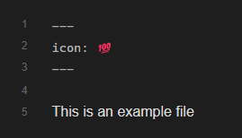
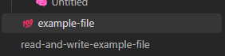

# Frontmatter Based Icons

Use frontmatter to add and icon in the file explorer integrated in Obsidian.

## 🔤 How to use

```
---
icon: 📄
---

# My note

This is a note with an icon.

```

## 😝 Icons

You can use any emoji or text as an icon, actually any character or string will work.

## 📸 Screenshots 




## ⚠️ Must know

> The icons/strings are only visible in the file explorer, they are not part of the file name.